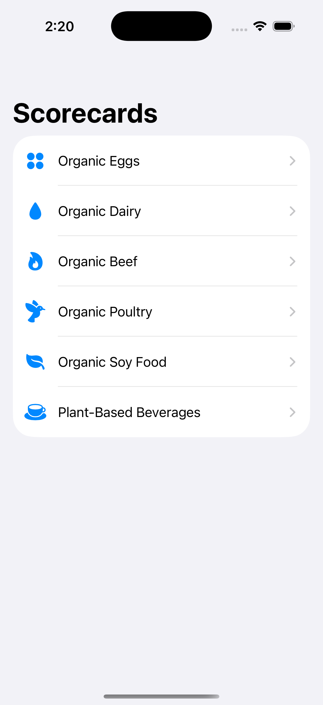
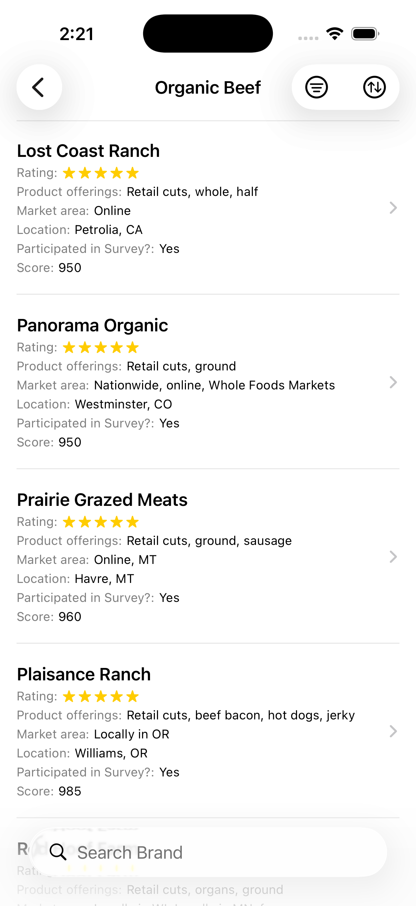
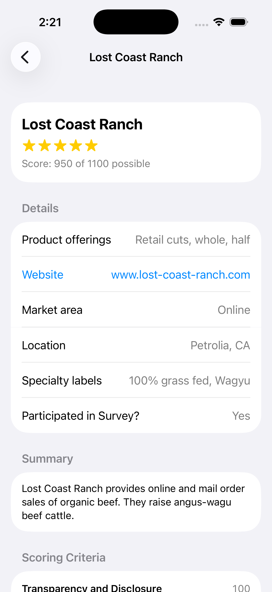
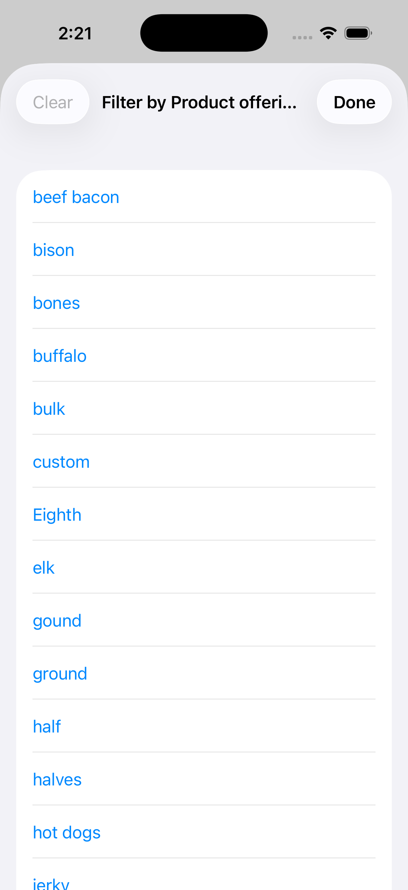

# Cornucopia Scorecards

An iOS app that presents [Cornucopia Institute](https://www.cornucopia.org)'s organic food scorecard data — browse product categories, drill into a brand list, and view the full scoring breakdown behind each brand's rating.

Cornucopia rates brands across several organic product categories (eggs, dairy, beef, poultry, soy foods, and plant-based beverages) from 1 to 5 stars based on criteria like animal welfare, ownership transparency, and commitment to organic standards. This app makes that data easy to browse, search, filter, and sort on your phone.

## Screenshots

| Categories | Brand list | Brand detail | Product filter |
|---|---|---|---|
|  |  |  |  |

## Features

- **Categories** — Organic Eggs, Organic Dairy, Organic Beef, Organic Poultry, Organic Soy Food, and Plant-Based Beverages.
- **Search** — filter any brand list by name.
- **Sort** — tap any column to sort by it; tap again to reverse direction. Lists default to Rating, descending (5-star brands first).
- **Product filter** — categories with a product-list column (e.g. Dairy's "Products," Beef's "Product offerings") offer a multi-select filter sheet, so you can narrow, say, Dairy down to just Fluid Milk and Cheese brands without a separate category for each.
- **Brand detail** — rating, score, market area, website, and (where available) a summary plus the full scoring criteria breakdown Cornucopia used to arrive at that brand's score, with an expandable "why this matters" explanation per criterion.

## Data

All data is scraped from the public scorecard pages at cornucopia.org and bundled with the app — no network access required at runtime.

- **Listings** (`CornucopiaScorecards/Resources/*.csv`) — one row per brand per category, mirroring the columns shown on each scorecard's listing page.
- **Brand detail** (`CornucopiaScorecards/Resources/*_details.json`) — one entry per brand, keyed by brand name, holding the summary paragraph and full criteria/points/comment breakdown from that brand's individual scorecard page.

JSON was chosen over YAML for the detail files since Swift's `Codable`/`JSONDecoder` handles it natively, with no extra dependency required.

## Project structure

This is a [XcodeGen](https://github.com/yonaskolb/XcodeGen) project: `project.yml` is the source of truth, and `CornucopiaScorecards.xcodeproj` is a generated build artifact (gitignored, not committed).

```
.
├── project.yml                     # XcodeGen project spec
├── CornucopiaScorecards/
│   ├── CornucopiaScorecardsApp.swift
│   ├── Models/                     # ScorecardCategory, ScorecardTable, BrandDetail, ...
│   ├── Views/                      # CategoriesView, CategoryDetailView, BrandDetailView, ...
│   ├── Utilities/                  # CSV parsing/loading, brand detail loading
│   └── Resources/                  # Bundled CSV + JSON data
└── Screenshots/
```

## Building and running

Requires Xcode and [XcodeGen](https://github.com/yonaskolb/XcodeGen) (`brew install xcodegen`).

```bash
git clone git@github.com:jimgrund/cornucopia_ios.git
cd cornucopia_ios
xcodegen generate
open CornucopiaScorecards.xcodeproj
```

Then build and run onto a simulator or a device from Xcode (⌘R). To run on a physical iPhone, sign in with your Apple ID under Xcode → Settings → Accounts, set the target's Team under Signing & Capabilities, and select your device as the run destination.

## Disclaimer

This is an unofficial, independently built client for publicly available Cornucopia Institute scorecard data. It is not affiliated with or endorsed by the Cornucopia Institute.
